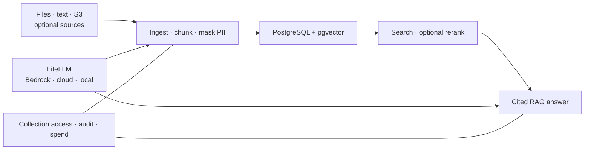
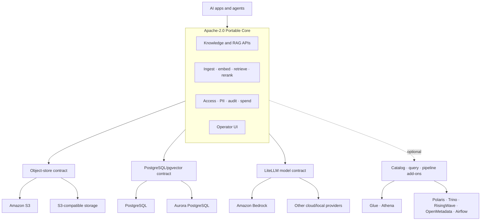

# DataPond — Portable AI Data Foundation

> **Build governed RAG and agent data flows once. Keep storage, vectors, models, and deployment replaceable.**

DataPond is an open-core AI data foundation for teams moving RAG and agent applications from a prototype to an operated system. It ships the application layer that is repeatedly rebuilt by hand—ingestion, chunk replacement, embeddings, retrieval, optional reranking, cited answers, collection access, PII controls, and per-user model spend—while keeping infrastructure behind open contracts.

**AWS is the current reference deployment, not the product boundary.** Use native S3, Aurora PostgreSQL/pgvector, Glue/Athena, and Bedrock where the AWS reference enables them, or run the same core with PostgreSQL, S3-compatible storage, local/cloud models through LiteLLM, and selected OSS add-ons.

## Product model

| Layer | Role | Current status |
|---|---|---|
| **Portable Core** | Knowledge/RAG APIs and UI, ingestion, pgvector retrieval, citations, PII, collection ACL, AI usage/spend | Shipped |
| **Open contracts** | S3 API, PostgreSQL + pgvector, LiteLLM/OpenAI-compatible model boundary, REST, OIDC, Helm/Kubernetes | Shipped |
| **AWS adapters** | S3, Aurora, Bedrock; Glue/Athena in the single-node reference | Shipped per profile |
| **OSS add-ons** | Trino, Polaris, RisingWave, OpenMetadata, Airflow, Jupyter, MLflow, Spark | Optional and capability-gated |
| **Future adapters** | EKS installer, EMR Serverless, S3 Tables, Lake Formation, AOSS, DataZone, Marketplace packaging | Roadmap |

A disabled OSS component is simply absent. DataPond does **not** claim that Helm automatically provisions an AWS replacement.

## Core workflow



1. **Connect** content directly to Knowledge, or enable a source/catalog adapter.
2. **Organize** it in collections; use Iceberg catalogs only when table workflows need them.
3. **Ground** AI with chunking, embeddings, pgvector search, optional reranking, and citations.
4. **Serve** models through LiteLLM logical model names.
5. **Govern** collection access, PII behavior, audit events, and model spend.

## Architecture



The product domain does not require every component in the diagram. Runtime capability flags drive the UI, so optional modules are hidden when their backing adapter or add-on is not enabled.

## Deployment profiles

| Helm values | Product role | What it actually does |
|---|---|---|
| `values-foundation.yaml` | **Portable Core · AWS starter** | About five workloads: backend, frontend, PostgreSQL/pgvector, LiteLLM, Valkey; external native S3 + Bedrock; no catalog/query service |
| `values-prod-single.yaml` | **AWS Single-Node Reference** | EC2/K3s application node with external Aurora, S3, Glue/Athena, Bedrock, ECR, TLS, and CloudWatch metrics; not application-node HA |
| `values-aws.yaml` | **AWS Hybrid Extended compatibility** | Connects an existing Kubernetes cluster to S3, Bedrock, and external PostgreSQL while inheriting optional OSS defaults; does not provision EKS |
| `values-onprem.yaml` | **Sovereign OSS Extended** | Self-hosted core plus selected local/OSS services; higher operational footprint |
| `values-dev.yaml`, `values-quicktest.yaml` | Development/test | Reduced-resource integration environments |
| `values-prod.yaml` | Self-hosted extended compatibility | Large full-stack profile; not the recommended AWS reference |

See [Deployment Profiles](docs/DEPLOYMENT_PROFILES.md) before choosing a profile.

## Quick start: Portable Core · AWS

Prerequisites: Kubernetes + Helm, access to an S3 bucket, and Bedrock model access/credentials. The profile runs PostgreSQL/pgvector in-cluster.

```bash
helm upgrade --install datapond helm/datapond \
  --namespace datapond --create-namespace \
  --values helm/datapond/values-foundation.yaml
```

Then:

1. Sign in and open **Knowledge**.
2. Create a collection.
3. Ingest text or an S3 source.
4. Test semantic search, then ask a cited RAG question.
5. Review **Governance** and **AI Gateway** for access, PII, usage, and spend.

For the AWS infrastructure reference, follow [Deploying the AWS Single-Node Reference](docs/DEPLOY_SINGLE_NODE.md), not `values-aws.yaml`.

## Portability and exit strategy

Portability is based on the data and protocol boundaries:

- object data through the S3 API;
- application state and vectors in PostgreSQL/pgvector;
- Parquet + Apache Iceberg when table workflows are enabled;
- provider-neutral logical model names through LiteLLM;
- containers, Helm, and Kubernetes for deployment;
- local JWT/LDAP/passkeys and Enterprise OIDC for identity integration.

Today, exit procedures use normal S3 copy, PostgreSQL backup/restore, provider rebinding, and re-embedding when model dimensions change. A unified `datapond export/import` command and automated cross-provider exit drill are **roadmap**, not shipped functionality. See [Portability and Exit Strategy](docs/PORTABILITY.md).

## Current product boundary

### Shipped

- Text, S3, and configured Iceberg-source ingestion into Knowledge
- Chunk replacement by source group and scheduled freshness
- PII masking during ingestion and retrieval
- PostgreSQL/pgvector HNSW search
- Optional LiteLLM reranking with vector-order fallback
- Bedrock/LiteLLM cited RAG responses
- Collection owner/admin/shared application-level ACL
- Catalog → Knowledge bridge when a catalog adapter is enabled
- Per-user LiteLLM usage and spend attribution
- Capability-gated navigation and direct-route states
- Community authentication plus Enterprise OIDC SSO

### Optional

- Glue/Athena data plane in the AWS single-node reference
- Polaris/Trino catalog and query
- RisingWave streaming, Airflow/Spark transforms
- OpenMetadata external lineage
- Jupyter/DuckDB exploration and MLflow experiments

### Roadmap or hardening

- EKS infrastructure module and HA reference topology
- EMR Serverless, S3 Tables, Lake Formation, AOSS, DataZone, Marketplace packaging
- Database-enforced Knowledge collection RLS (current collection ACL is application-level)
- Durable budget notification delivery
- Automated provider migration/export and recurring exit acceptance tests
- Live multi-profile acceptance gates and remaining security/quality backlog

## Documentation

- [Active documentation index](docs/README.md)
- [Product concept](docs/PRODUCT_CONCEPT.md)
- [Architecture](docs/ARCHITECTURE.md)
- [Deployment profiles](docs/DEPLOYMENT_PROFILES.md)
- [Portable Core profile](docs/FOUNDATION_PROFILE.md)
- [Portability and exit strategy](docs/PORTABILITY.md)
- [AWS single-node deployment](docs/DEPLOY_SINGLE_NODE.md)
- [AWS RAG acceptance runbook](docs/AWS_MVP_RUNBOOK.md)
- [Disaster recovery](docs/DISASTER_RECOVERY.md)
- [Bedrock adapter setup](docs/AWS_BEDROCK_SETUP.md)

`docs/superpowers/plans/` and `docs/superpowers/specs/` are historical implementation records. They explain past decisions but are not the current product contract.

## License and editions

DataPond Community is Apache-2.0 except for [`/ee`](ee/README.md), which is commercially licensed. Community includes the portable core and the ability to move your data and provider configuration. Enterprise adds organization-level identity and operational capabilities such as OIDC SSO and future centrally managed policy/support features.

Review [THIRD_PARTY_NOTICES.md](THIRD_PARTY_NOTICES.md) before enabling optional profiles; some upstream images use AGPL or source-available licenses.
