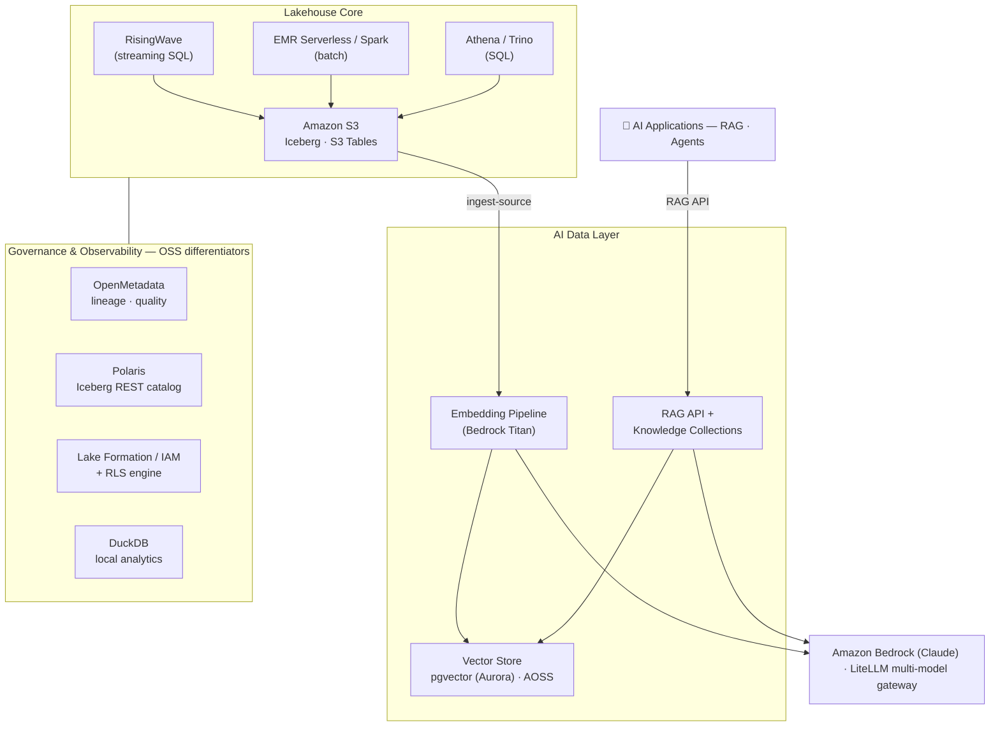

# DataPond — AWS-Native Data Foundation for AI Apps

> **The S3 + Bedrock native data foundation that fuels RAG and agent applications on AWS —**
> **with open-source governance, catalog, and streaming as the differentiators.**

---

## 🎯 Overview

**DataPond is a data-foundation platform for teams taking AI applications (RAG, agents) from PoC to production on AWS.**

Moving RAG to production means hand-assembling the whole pipeline — S3 data → chunking →
embedding → vector loading → retrieval → Bedrock responses — while governance (permissions,
lineage, PII, cost) gets deferred indefinitely. DataPond ships that pipeline **complete with
governance built in**. Where Bedrock Knowledge Bases gives you retrieval, DataPond adds
access control, cost attribution, and lakehouse integration on top. It runs inside the
customer's own AWS account (data sovereignty preserved), and its differentiating layers are
open source (no lock-in).

**Who it's for:** AI application developers and platform engineers at organizations already
on AWS who need RAG/agents in production — and for whom hand-wiring S3 → embeddings →
vector search → governance is too much undifferentiated plumbing.

### Core value

1. **A governance-complete AI data pipeline** — ingestion with chunk upserts, retries, and
   PII masking; pgvector RAG with reranking and per-collection row-level security; a
   catalog → knowledge bridge; OpenMetadata lineage; per-user cost attribution and budget
   alerts. Not a RAG demo — **a production RAG foundation with governance**.
2. **AWS-native core, zero ops burden** — S3 for storage, Athena for queries, EMR
   Serverless for batch, Bedrock (Claude) + LiteLLM multi-model routing for LLMs, and
   pgvector on Aurora by default (OpenSearch Serverless at scale).
3. **Open-source differentiation layer for portability** — governance (OpenMetadata),
   catalog (Polaris), streaming (RisingWave), and local analytics (DuckDB) stay OSS.
   The hybrid principle: replace only low-differentiation infrastructure with AWS managed
   services; keep the layers that matter open.

### Positioning

| | |
|---|---|
| **Core value** | AWS-native AI data foundation — the data fuel for RAG & agents |
| **Target** | AI app dev teams / platform engineers building on AWS |
| **Competes on** | Depth of AWS integration + governance + portability (not price) |
| **Model** | **Hybrid** — AWS core (S3 · Athena · EMR · Bedrock) + OSS differentiators (Polaris · OpenMetadata · RisingWave · DuckDB) |
| **Main competitors** | Snowflake Cortex · Databricks · AWS DIY |

> Full concept, competitive analysis, and business model: [docs/PRODUCT_CONCEPT.md](docs/PRODUCT_CONCEPT.md) ·
> Design spec: [docs/superpowers/specs/2026-06-30-aws-ai-data-platform-pivot-design.md](docs/superpowers/specs/2026-06-30-aws-ai-data-platform-pivot-design.md)

## 🏗️ Architecture



**Layer by layer — what's AWS-managed vs open source:**

| Layer | AWS core (managed) | OSS differentiator | Why |
|---|---|---|---|
| Storage & tables | S3, S3 Tables + Glue Catalog | Apache Iceberg format | Zero-ops durability; open table format |
| Query & batch | Athena, EMR Serverless | Trino, Spark (self-hosted profiles) | Serverless by default; engine portability |
| Streaming | Kinesis/MSK sources | **RisingWave** — PostgreSQL-wire streaming SQL → Iceberg | CDC & streams without a Spark cluster |
| Vector / RAG | Bedrock (embeddings + LLM), Aurora pgvector, AOSS | RAG service with rerank + per-collection RLS | Governed retrieval, not just search |
| Catalog & governance | Lake Formation / IAM | **Polaris** (Iceberg REST), **OpenMetadata** (lineage/quality), RLS + Korean-PII guardrails | Cross-engine catalog; portable governance |
| LLM access | Amazon Bedrock (Claude) | **LiteLLM** gateway — routing, fallbacks, per-user spend, budgets | Multi-model + cost governance |
| Local analytics | — | **DuckDB** reads Iceberg straight from S3 | Exploration without a cluster |

**Data paths:** streaming (Kafka/Kinesis → RisingWave → Iceberg) · batch (Airflow → Spark/EMR → Iceberg) ·
analytics (Athena/Trino → Polaris → Iceberg) · RAG (S3/lakehouse → embeddings → pgvector → Bedrock) ·
exploration (JupyterLab → DuckDB → Iceberg on S3).

Object storage defaults to **native S3** (`storage.endpoint: ""` + IAM); self-hosted/dev
profiles use S3-compatible **MinIO**.

## 🚀 Quickstart

```bash
# AWS-native AI Data Foundation (recommended — 5 workloads)
helm upgrade --install datapond helm/datapond -n datapond \
  -f helm/datapond/values-foundation.yaml

# Full-stack profiles: values-aws.yaml (EKS+S3+Bedrock) · values-onprem.yaml · values-quicktest.yaml
```

Bedrock credentials: `docs/AWS_BEDROCK_SETUP.md` · Infrastructure provisioning: `terraform/README.md`.

---

## 🧭 Status: pivot complete → productization hardening in progress

DataPond pivoted from a vendor-neutral OSS Databricks alternative (v3.0) to the
**AWS-native AI data foundation** (v4.0). The MVP (S3 → embeddings → pgvector → Bedrock RAG)
is merged to main; current work is the productization P0 backlog (security & ops hardening).
Previous concept: see [ARCHIVE.md](ARCHIVE.md) — preserved on the `archive/oss-lakehouse`
branch / `v3.0-oss-lakehouse` tag.

### Shipped since the pivot (merged to main)

- **AWS MVP** — S3 → Bedrock embeddings → Aurora pgvector → Bedrock RAG end-to-end + Terraform reference IaC (`terraform/`: S3, Aurora, IAM/IRSA) (#100)
- **Storage migration** — SeaweedFS → MinIO; AWS-native S3 as the base default + unified `storage.endpoint` (#101, #102)
- **LiteLLM ↔ Bedrock credentials** — IRSA / static-key / instance-profile modes (#103)
- **Lean "AI Data Foundation" Helm profile** — `values-foundation.yaml`, 16 workloads → 5 (backend, frontend, Postgres+pgvector, LiteLLM, Valkey); heavy lakehouse components replaced by AWS managed services (#104)
- **UI capability gating** — `/api/capabilities` + Helm `FEATURE_*` flags hide pages for disabled components (#105)
- **Secrets hardening P0-1a/1b** — critical secrets + component passwords fail closed in production, Helm lookup-preserve generation, zero plaintext credentials in pod manifests (#106, #107)
- **Apache-2.0 open core** — LICENSE/NOTICE + fact-checked third-party attribution, `/ee` commercial-edition boundary, CI license gate (#108)

## 🗺️ Roadmap

- **Phase 0** — Archive previous concept ✅
- **Phase 1** — Concept redefinition (PRODUCT_CONCEPT, README) ✅
- **Phase 2** — Reference architecture (Terraform IaC ✅ · security hardening 🔄)
- **Phase 3** — MVP (S3 → embeddings → vector → Bedrock RAG end-to-end) ✅ — [plan](docs/superpowers/plans/2026-06-30-aws-mvp-bedrock-rag.md)
- **Phase 4** — GTM realignment

**P0 backlog (productization hardening):** ~~secrets/password hardening~~ ✅ · ~~LICENSE / third-party attribution~~ ✅ ·
SSO (OIDC, first `/ee` feature) 🔄 · ~~image-tag pinning~~ ✅ · backup/DR (Aurora) · lakehouse-service IRSA · AWS live apply + E2E

## 📄 License

DataPond is **Apache-2.0** ([LICENSE](LICENSE)) — everything in this repository except
the [`/ee`](ee/README.md) directory, which is reserved for commercially-licensed
Enterprise features ([ee/LICENSE](ee/LICENSE)). Third-party components and their
licenses are inventoried in [THIRD_PARTY_NOTICES.md](THIRD_PARTY_NOTICES.md) —
regulated-procurement note included (the foundation profile deploys no AGPL/ELv2
components; see the notices file for per-profile details).
