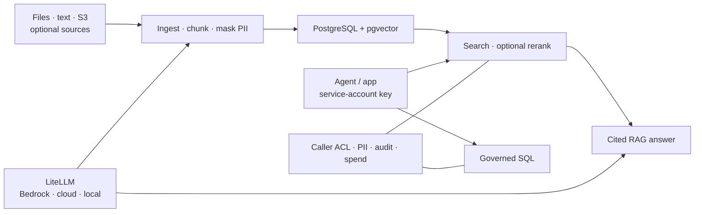
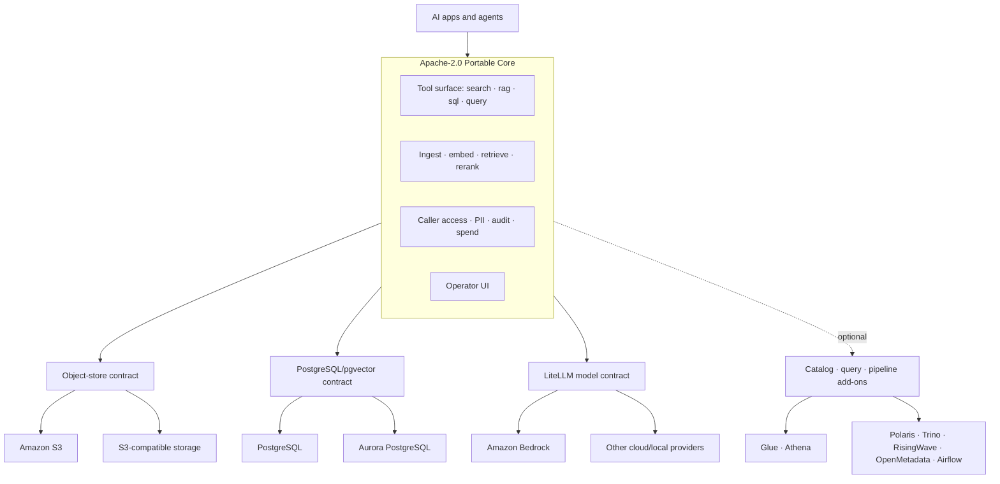

# DataPond — Governed data tool server for AI agents and apps

> **Give agents and applications governed access to your documents and tables. Cited RAG and governed SQL as tools, governed at the data layer: which caller may read which collection or row; what was cited and what was masked; how much each caller may spend.**

DataPond is an open-core data tool server for teams whose AI agents and applications need to reach company data. Agents call it **directly** with a service-account key, and if your organization runs an agent gateway (Amazon Bedrock AgentCore Gateway, Obot, Runlayer) DataPond can be registered behind it as a target. Either way it does the part gateways do not: ingestion and freshness, chunking and embeddings, pgvector retrieval with optional reranking, cited answers, governed SQL, per-caller collection and row access, PII masking on the data itself, audit, and per-caller model spend. Infrastructure stays behind open contracts. Retrieval-level audit of successful calls and enforced per-caller budgets are listed under roadmap below, not claimed as shipped.

The tool surface is **REST/OpenAPI with service-account keys**, and a read-only MCP server at `POST /api/mcp` exposes the same 26 read actions as tools for agents that discover tools rather than being wired to them by hand. DataPond does not build gateway features (agent registry, SSO/SCIM sync, tool-level policy engines). **AWS is the current reference deployment, not the product boundary.** Run on native S3, Aurora PostgreSQL/pgvector, Glue/Athena, and Bedrock, or on PostgreSQL, S3-compatible storage, and local/cloud models through LiteLLM.

Positioning decision and its evidence: [docs/POSITIONING_REVIEW.md](docs/POSITIONING_REVIEW.md). How well the current build fits it: [docs/POSITIONING_FIT_AUDIT.md](docs/POSITIONING_FIT_AUDIT.md).

## Product model

| Layer | Role | Current status |
|---|---|---|
| **Governed data tool server** | `/api/ai/search`, `/api/ai/rag`, `/api/ai/sql`, `/api/queries/execute` behind service-account keys; collection ACL, RLS/masking, PII, audit, per-caller spend; called directly, or registered behind an agent gateway if you run one | Shipped (REST and read-only MCP) |
| **Knowledge core** | Ingestion, chunk replacement, freshness scheduler, pgvector retrieval, citations, operator UI | Shipped |
| **Open contracts** | S3 API, PostgreSQL + pgvector, LiteLLM/OpenAI-compatible model boundary, REST, OIDC, Helm/Kubernetes | Shipped |
| **AWS adapters** | S3, Aurora, Bedrock; Glue/Athena in the single-node reference | Shipped per profile |
| **OSS add-ons** | Trino, Polaris, RisingWave, OpenMetadata, Airflow, Jupyter, MLflow, Spark | Optional and capability-gated |
| **Future adapters** | EKS installer, EMR Serverless, S3 Tables, Lake Formation, AOSS, DataZone, Marketplace packaging | Roadmap |

A disabled OSS component is simply absent. DataPond does **not** claim that Helm automatically provisions an AWS replacement.

## Core workflow


```mermaid
flowchart LR
    SRC[Files · text · S3<br/>optional sources] --> ING[Ingest · chunk · mask PII]
    ING --> VEC[PostgreSQL + pgvector]
    VEC --> RET[Search · optional rerank]
    RET --> RAG[Cited RAG answer]
    AGENT[Agent / app<br/>service-account key] --> RET
    AGENT --> SQL[Governed SQL]
    GW[LiteLLM<br/>Bedrock · cloud · local] --> ING
    GW --> RAG
    GOV[Caller ACL · PII · audit · spend] --- RET
    GOV --- SQL
```

1. **Connect** content directly to Knowledge, or enable a source/catalog adapter.
2. **Organize** it in collections; share them with the people and service accounts that need them.
3. **Ground** AI with chunking, embeddings, pgvector search, optional reranking, and citations.
4. **Expose** search, cited answers, and governed SQL to your agent or app through a service-account key.
5. **Govern** who called what, PII behavior, audit events, and per-caller model spend.

## Architecture


```mermaid
flowchart TB
    APP[AI apps and agents] --> CORE

    subgraph CORE[Apache-2.0 Portable Core]
      API[Tool surface: search · rag · sql · query]
      PIPE[Ingest · embed · retrieve · rerank]
      GOV[Caller access · PII · audit · spend]
      UI[Operator UI]
    end

    CORE --> OBJ[Object-store contract]
    CORE --> DB[PostgreSQL/pgvector contract]
    CORE --> LLM[LiteLLM model contract]
    CORE -. optional .-> DATA[Catalog · query · pipeline add-ons]

    OBJ --> S3[Amazon S3]
    OBJ --> S3C[S3-compatible storage]
    DB --> PG[PostgreSQL]
    DB --> AUR[Aurora PostgreSQL]
    LLM --> BR[Amazon Bedrock]
    LLM --> OTHER[Other cloud/local providers]
    DATA --> AWS[Glue · Athena]
    DATA --> OSS[Polaris · Trino · RisingWave · OpenMetadata · Airflow]
```

The product domain does not require every component in the diagram. Runtime capability flags drive the UI, so optional modules are hidden when their backing adapter or add-on is not enabled.

## Deployment profiles

| Helm values | Product role | What it actually does |
|---|---|---|
| `values-foundation.yaml` | **Portable Core · AWS starter** | About five workloads: backend, frontend, PostgreSQL/pgvector, LiteLLM, Valkey; external native S3 + Bedrock; no catalog/query service |
| `values-sovereign-core.yaml` | **Sovereign Core** | On-prem twin of the AWS starter: core five + in-cluster MinIO + Ollama; no catalog/query, no add-ons, no egress |
| `values-prod-single.yaml` | **AWS Single-Node Reference** | EC2/K3s application node with external Aurora, S3, Glue/Athena, Bedrock, ECR, TLS, and CloudWatch metrics; not application-node HA |
| `values-aws.yaml` | **AWS Hybrid Extended compatibility** | Connects an existing Kubernetes cluster to S3, Bedrock, and external PostgreSQL; states none of the OSS add-on flags, so a fresh install renders none and an existing cluster keeps whatever it is already running; does not provision EKS |
| `values-onprem.yaml` | **Sovereign OSS Extended** | Self-hosted core plus selected local/OSS services; higher operational footprint |
| `values-dev.yaml`, `values-quicktest.yaml` | Development/test | Reduced-resource integration environments |
| `values-prod.yaml` | Self-hosted extended compatibility | Large full-stack profile; not the recommended AWS reference |

See [Deployment Profiles](docs/DEPLOYMENT_PROFILES.md) before choosing a profile.

## Quick start: Portable Core · AWS

Prerequisites: Kubernetes + Helm, access to an S3 bucket, and Bedrock model access/credentials. The profile runs PostgreSQL/pgvector in-cluster.

```bash
helm upgrade --install datapond helm/datapond \
  --namespace datapond --create-namespace \
  --values helm/datapond/values-foundation.yaml
```

Then:

1. Sign in and open **Knowledge**.
2. Create a collection and ingest text or an S3 source.
3. Test semantic search, then ask a cited RAG question.
4. Open **API**, issue a service-account key with `knowledge:read` and `ai:generate`, and call `/api/ai/rag` from your app or agent using the curl sample shown there.
5. Review **Governance** and **AI Gateway** for who called what, PII, usage, and spend.

For the AWS infrastructure reference, follow [Deploying the AWS Single-Node Reference](docs/DEPLOY_SINGLE_NODE.md), not `values-aws.yaml`.

Self-hosted instead of AWS? Use `values-sovereign-core.yaml` — the same core with in-cluster MinIO and Ollama instead of S3 and Bedrock. See [SOVEREIGN_CORE_PROFILE.md](docs/SOVEREIGN_CORE_PROFILE.md).

## Portability and exit strategy

Portability is based on the data and protocol boundaries:

- object data through the S3 API;
- application state and vectors in PostgreSQL/pgvector;
- Parquet + Apache Iceberg when table workflows are enabled;
- provider-neutral logical model names through LiteLLM;
- containers, Helm, and Kubernetes for deployment;
- local JWT/LDAP/passkeys and Enterprise OIDC for identity integration.

Today, exit procedures use normal S3 copy, PostgreSQL backup/restore, provider rebinding, and re-embedding when model dimensions change. A unified `datapond export/import` command and automated cross-provider exit drill are **roadmap**, not shipped functionality. See [Portability and Exit Strategy](docs/PORTABILITY.md).

## Current product boundary

### Shipped

- Text, S3, and configured Iceberg-source ingestion into Knowledge
- Chunk replacement by source group and scheduled freshness
- PII masking during ingestion and retrieval
- PostgreSQL/pgvector HNSW search
- Optional LiteLLM reranking with vector-order fallback
- Bedrock/LiteLLM cited RAG responses
- Service-account keys scoped to role ∩ requested permissions, with expiry
- Collection owner/admin/member (reader/editor) application-level ACL
- SQL statement-kind gate: write statements need `query:write`, unclassifiable statements are refused
- Append-only audit of authorization decisions with NDJSON export
- Catalog → Knowledge bridge when a catalog adapter is enabled
- Per-user LiteLLM usage and spend attribution
- Capability-gated navigation and direct-route states
- Community authentication plus Enterprise OIDC SSO
- Append-only tool call log: who called search, cited answers, SQL generation or query execution, against which collection or tables, with hit count, cited sources and PII masked; NDJSON export and compliance-report section
- Read-only MCP server at POST /api/mcp (2026-07-28 stateless HTTP): the 26 read actions as tools, scoped by the calling key, one audit row per call

### Optional

- Glue/Athena data plane in the AWS single-node reference
- Polaris/Trino catalog and query
- RisingWave streaming (Experimental)
- Airflow-backed SQL transforms deploy and run; the declarative pipeline builder on the
  same page is Preview and refuses to deploy
- Spark batch compute (no console surface of its own)
- OpenMetadata external lineage (Experimental)
- Jupyter/DuckDB exploration and MLflow experiments (Experimental)

### Roadmap or hardening

- Resource-server mode for external OIDC access tokens, required by OAuth-based MCP clients and by token exchange behind a gateway (API-key registration behind a gateway today collapses all agents into one service account)
- Tool-facing OpenAPI subset (no `anyOf`, explicit operationIds) for gateway target registration; today the generated `/openapi.json` is not accepted by AgentCore Gateway as-is
- Chunk/document-level caller filters inside a collection
- Enforced per-caller budgets (today: LiteLLM virtual-key budgets and reporting only)
- Keys bound directly to collections or tables (today: collection membership and RLS by service-account identity)
- Production default-deny RLS and WORM audit under a separate database role
- EKS infrastructure module and HA reference topology
- EMR Serverless, S3 Tables, Lake Formation, AOSS, DataZone, Marketplace packaging
- Database-enforced Knowledge collection RLS (current collection ACL is application-level)
- Durable budget notification delivery
- Automated provider migration/export and recurring exit acceptance tests
- Live multi-profile acceptance gates and remaining security/quality backlog

## Documentation

- [Active documentation index](docs/README.md)
- [Product concept](docs/PRODUCT_CONCEPT.md)
- [Positioning review and decision](docs/POSITIONING_REVIEW.md)
- [Positioning fit audit](docs/POSITIONING_FIT_AUDIT.md)
- [Architecture](docs/ARCHITECTURE.md)
- [Deployment profiles](docs/DEPLOYMENT_PROFILES.md)
- [Portable Core profile](docs/FOUNDATION_PROFILE.md)
- [Portability and exit strategy](docs/PORTABILITY.md)
- [AWS single-node deployment](docs/DEPLOY_SINGLE_NODE.md)
- [AWS RAG acceptance runbook](docs/AWS_MVP_RUNBOOK.md)
- [Disaster recovery](docs/DISASTER_RECOVERY.md)
- [Bedrock adapter setup](docs/AWS_BEDROCK_SETUP.md)

`docs/superpowers/plans/` and `docs/superpowers/specs/` are historical implementation records. They explain past decisions but are not the current product contract.

## License and editions

DataPond Community is Apache-2.0 except for [`/ee`](ee/README.md), which is commercially licensed. Community includes the portable core and the ability to move your data and provider configuration. Enterprise adds organization-level identity and operational capabilities such as OIDC SSO and future centrally managed policy/support features.

Review [THIRD_PARTY_NOTICES.md](THIRD_PARTY_NOTICES.md) before enabling optional profiles; some upstream images use AGPL or source-available licenses.
