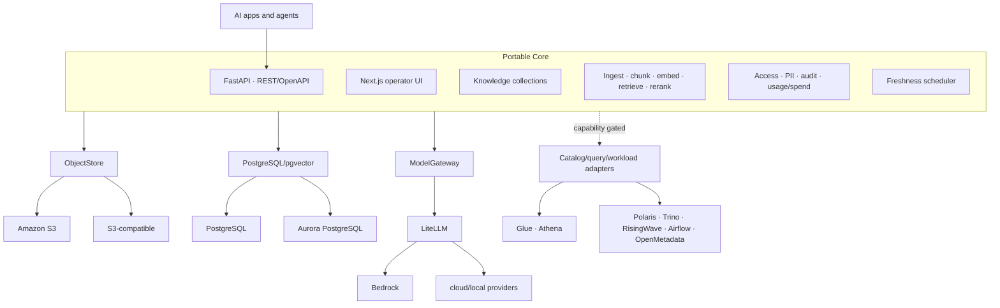

# DataPond Architecture

## 1. Architectural intent

DataPond separates a small, governed AI application layer from replaceable infrastructure. The core must remain useful without Trino, Spark, Airflow, OpenMetadata, Polaris, RisingWave, Jupyter, or MLflow.



## 2. Portable Core

| Component | Responsibility | Required dependency |
|---|---|---|
| Backend | Auth, Knowledge/RAG, governance, connectors, configuration | PostgreSQL; object/model adapters per operation |
| Frontend | Operator workflows and capability-aware navigation | Backend `/api/capabilities` |
| PostgreSQL + pgvector | Application state, collections, chunks, vectors | PostgreSQL 16 + vector extension |
| LiteLLM | Logical model routing, usage/spend boundary | Configured model provider |
| Valkey | Cache/session support | Optional future reduction target; deployed in current core profile |
| RAG scheduler | Periodic and connector-triggered collection freshness | PostgreSQL and core backend |

Knowledge collection authorization currently uses application-level owner/admin/shared checks. It should not be described as database-enforced collection RLS.

## 3. Adapter boundaries

### Object store

- Contract: S3 API and URI-based source references.
- Current: native Amazon S3 in AWS profiles; S3-compatible service in self-hosted profiles.
- Exit: object copy/version restore; do not store AWS credentials in domain records.

### State and vector

- Contract: PostgreSQL SQL semantics and pgvector.
- Current: in-cluster PostgreSQL or external Aurora PostgreSQL.
- Exit: logical/physical backup and restore; preserve extension version and embedding metadata.

### Model gateway

- Contract: LiteLLM logical model names and OpenAI-compatible calls.
- Current: Bedrock mappings in AWS profiles; local/cloud mappings may be configured by other profiles.
- Exit: rebind logical model names. Re-embed when model dimension or semantic behavior changes.

### Catalog and query

- AWS reference: Glue catalog + Athena query.
- OSS extended: Polaris catalog + Trino query.
- No adapter: Sources/Catalog/SQL Lab/Dashboards are capability-disabled.

Catalog/query are optional because the core can ingest text and S3 sources directly into Knowledge.

## 4. Optional add-ons

| Add-on | Capability | Operational note |
|---|---|---|
| Polaris | Iceberg REST catalog | Use with engines that support REST catalog |
| Trino | Distributed SQL | Not required for RAG |
| RisingWave | Streaming SQL/CDC | Enable only for continuous data flows |
| Airflow + Spark | DAG and batch transforms | Higher footprint |
| OpenMetadata | External catalog/lineage UI | Registration is best-effort |
| Jupyter + DuckDB | Interactive exploration | User-code execution boundary |
| MLflow | Experiment/model tracking | Optional ML workflow |

An add-on being disabled does not mean an equivalent AWS service exists. Provision and wiring are separate infrastructure work.

## 5. Capability model

`GET /api/capabilities` returns:

- stable boolean feature flags used to show/hide modules;
- active query/catalog adapter hints;
- non-secret product profile identity (`profile_id`, label, maturity, topology);
- object, vector, and model gateway hints.

Profile metadata is descriptive. Feature flags remain authoritative. Capability status means **configured**, not **healthy**; health belongs to Services/System APIs.

Optional navigation fails closed until the endpoint returns explicit `true`. Direct routes show the current profile and explain which adapter/add-on is missing.

## 6. Data paths

### Direct Knowledge path

```text
text/S3 → read → chunk → PII mask → embed → pgvector
question → embed → HNSW retrieve → optional rerank → model → cited answer
```

### Catalog bridge

```text
database/object source → Glue or Polaris/Iceberg → Catalog → Send to Knowledge
                                                        ↓
                                               scheduled re-embedding
```

### Governance and cost

```text
actor identity → collection ACL / table policy → audit
actor identity → LiteLLM user + metadata → usage/spend aggregation
```

## 7. Deployment architectures

### Portable Core · AWS starter

Kubernetes runs backend, frontend, PostgreSQL/pgvector, LiteLLM, and Valkey. Native S3 and Bedrock are external. No catalog/query service is enabled.

### AWS Single-Node Reference

Terraform creates an EC2/K3s node and connects it to Aurora, S3, Glue/Athena, Bedrock, ECR, IAM, Route53, Secrets Manager, and CloudWatch/SNS. The application node is not HA.

### Sovereign OSS Extended

Kubernetes runs core plus selected self-hosted object/model/data add-ons. This increases independence and operational responsibility.

## 8. Current non-goals and roadmap

Not currently provisioned as part of a maintained deployment:

- EKS cluster/node groups
- EMR Serverless
- S3 Tables
- Lake Formation
- OpenSearch Serverless/AOSS
- DataZone
- Marketplace packaging/billing
- unified export/import CLI

These may be future adapters. Historical design files do not change their current status.

## 9. Design rules

1. Keep Knowledge/RAG functional with every data add-on disabled.
2. Put provider-specific IDs and credentials behind adapter configuration.
3. Prefer open data/protocol boundaries over bundling more services.
4. Add a navigation capability only when its backend path is configured.
5. Keep health and capability separate.
6. Preserve backward-compatible profile filenames and API boolean keys.
7. Require migration and live acceptance evidence before claiming a new provider as shipped.
