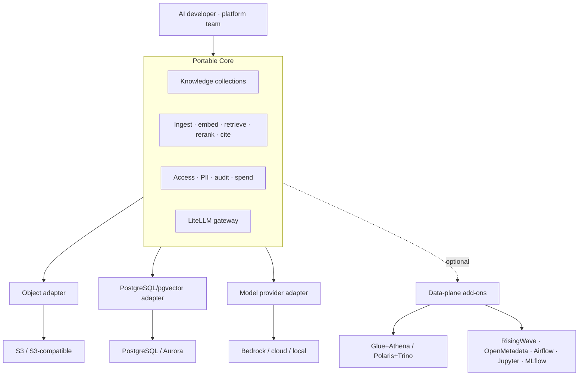

# DataPond 제품 컨셉 — Portable AI Data Foundation

**버전:** 5.0 · **상태:** 현재 제품 기준 · **갱신:** 2026-07-16

## 한 문장

> **DataPond는 governed RAG와 AI agent 데이터 경로를 제공하면서 저장소·벡터 DB·모델·배포 환경을 교체 가능하게 유지하는 Portable AI Data Foundation이다.**

AWS는 가장 구체적인 레퍼런스 배포이지만 제품의 경계는 아니다.

## 해결하는 문제

RAG PoC를 운영 단계로 옮기면 다음 배관을 팀이 직접 조립하게 된다.

- 소스 접근, 청킹, 임베딩, 벡터 적재와 신선도
- 검색 품질, reranking, citation
- 컬렉션 권한과 PII 보호
- 모델 키, routing, 사용자별 비용 귀속
- 소스 데이터와 Knowledge 사이 연결
- 백업, 복구, provider 변경

DataPond는 이 중 반복되는 **AI 애플리케이션 데이터 계층**을 제품으로 제공한다. 모든 분석·스트리밍·ML 엔진을 기본 설치하는 것이 목적이 아니다.

## 핵심 가치

### 1. Governed RAG Core

현재 구현된 코어:

- 텍스트, S3, 구성된 Iceberg source ingestion
- chunking 및 `source_group` 단위 교체
- PII masking과 retrieval 시 재보호
- PostgreSQL/pgvector HNSW 검색
- 선택적 LiteLLM rerank와 실패 시 vector-order fallback
- LiteLLM/Bedrock RAG와 citation
- collection owner/admin/shared 애플리케이션 ACL
- 사용자 ID와 앱 metadata를 통한 사용량·비용 귀속
- Airflow 없이 동작하는 Knowledge freshness scheduler

따라서 DataPond의 핵심 경쟁력은 “벡터 검색을 제공한다”가 아니라 **검색 전후의 운영·거버넌스 경로를 하나로 제공한다**는 점이다.

### 2. Portable by Contract

이식성은 모든 OSS를 동시에 운영해서가 아니라 다음 계약을 지켜서 얻는다.

| 경계 | 기본 계약 |
|---|---|
| Object | S3 API |
| State/vector | PostgreSQL + pgvector |
| Table | Parquet + Apache Iceberg, 사용 시 |
| Model | LiteLLM의 논리 model name과 OpenAI-compatible API |
| Identity | JWT, LDAP, WebAuthn, OIDC |
| Deployment | OCI image, Helm, Kubernetes |
| Application | REST/OpenAPI |

Provider 고유 ARN, model ID, bucket/warehouse URI, credential은 가능한 한 adapter 설정에 격리한다.

### 3. AWS-Ready, Not AWS-Locked

AWS single-node reference는 다음을 실제 제공한다.

- EC2/K3s application node
- Aurora PostgreSQL Serverless v2 + pgvector
- S3
- Glue Data Catalog + Athena
- Bedrock through LiteLLM
- ECR, IAM/instance profile, Route53, Secrets Manager, CloudWatch/SNS

그러나 현재 Terraform은 EKS, EMR Serverless, S3 Tables, Lake Formation, AOSS, DataZone, Marketplace를 만들지 않는다. 이 항목은 구현·acceptance 전까지 roadmap이다.

## 제품 구조

## 사용자와 주요 여정

### Primary: AI application team

- RAG/agent PoC는 있으나 데이터 ingestion, 권한, PII, 비용 운영이 부족하다.
- 작은 팀으로 고객 계정/VPC 안에서 빠르게 운영해야 한다.
- 첫 여정: **Knowledge 생성 → 데이터 적재 → retrieval 검증 → cited answer → governance/spend 확인**.

### Secondary: platform/data team

- S3/Iceberg 테이블을 AI application에 연결하고 싶다.
- Glue/Athena 또는 Polaris/Trino를 선택적으로 사용한다.
- Catalog → Send to Knowledge를 통해 table data를 vector collection으로 연결한다.

### Regulated/sovereign team

- 외부 반출과 vendor dependency를 통제해야 한다.
- local model과 self-hosted object/catalog/query add-on을 선택한다.
- 추가 운영 부담과 upstream license를 명시적으로 수용한다.

## 메뉴 정보구조

| 영역 | 메뉴 | 원칙 |
|---|---|---|
| Home | Dashboard | profile, core workflow, health |
| Build AI | Knowledge, AI Gateway | 모든 프로필에서 표시 |
| Data | Sources, Catalog, SQL Lab | adapter capability가 true일 때만 표시 |
| Add-ons | Transforms, Streaming, Dashboards, Notebooks, Experiments | 해당 OSS/engine이 활성화될 때만 표시 |
| Operate | Governance, Storage, Services, System, Settings | core 운영 기능 |
| Learn | Documentation, Guides | shipped/optional/roadmap 구분 |

직접 URL 접근 시 현재 profile과 필요한 adapter/add-on을 설명한다. 메뉴가 없다는 이유만으로 기능이 “AWS에서 자동 제공”된다고 표현하지 않는다.

## 배포 프로필

- **Portable Core · AWS starter:** 가장 작은 RAG core. S3/Bedrock + in-cluster pgvector.
- **AWS Single-Node Reference:** 현재 실제 AWS managed-adapter 레퍼런스. EC2/K3s이며 EKS가 아니다.
- **AWS Hybrid Extended:** 기존 Kubernetes에 heavy OSS stack과 AWS endpoint를 혼합하는 compatibility profile.
- **Sovereign OSS Extended:** local control을 위한 self-hosted profile. 최소 footprint가 아니라 선택권이 목적이다.

상세는 [DEPLOYMENT_PROFILES.md](DEPLOYMENT_PROFILES.md)를 따른다.

## 거버넌스 경계

- Knowledge collection 보안은 현재 PostgreSQL native RLS가 아니라 application-level owner/admin/shared ACL이다.
- table RLS/column masking은 별도 governance engine 설정에 따른다.
- OpenMetadata lineage는 optional이며 connector 등록은 best-effort이다.
- 비용 budget 상태는 조회 가능하지만 durable notification workflow는 향후 hardening 대상이다.
- UI capability gate는 UX 경계이며 API authorization을 대체하지 않는다.

## 출구 전략

현재 이동 가능한 자산:

- S3 API로 접근 가능한 원본·가공 object
- PostgreSQL dump/restore 가능한 application state와 pgvector
- Helm values의 adapter 설정
- LiteLLM logical model mapping
- Parquet/Iceberg table metadata, 활성화한 경우

주의 사항:

- embedding model/dimension이 바뀌면 re-embedding이 필요하다.
- Iceberg metadata의 warehouse URI가 바뀌면 rewrite 또는 table 재등록이 필요하다.
- `ENCRYPTION_KEY` 없이는 저장된 credential을 복호화할 수 없다.
- 통합 export/import CLI와 자동 exit drill은 아직 roadmap이다.

## Open Core 원칙

Community에 남겨야 하는 기능:

- 데이터·metadata export와 provider 변경 경로
- Knowledge/RAG core와 portable adapter interfaces
- S3/PostgreSQL/LiteLLM/Iceberg 표준 지원
- 기본 access/PII/audit/spend 거버넌스

Enterprise 가치:

- OIDC SSO와 향후 조직 단위 identity/policy
- 중앙 운영, compliance policy pack, SLA/support
- 다중 환경 관리와 검증된 migration 지원

고객의 데이터를 이동시키는 기능을 상용 edition으로 잠그지 않는다.

## 경쟁 기준

| 대안 | 장점 | DataPond의 차별점 |
|---|---|---|
| Bedrock Knowledge Bases | 빠른 AWS retrieval | application-level governance, cost attribution, portable model/vector boundary |
| AWS DIY | 서비스 선택 자유 | 반복 배관을 제품화하고 profile/capability UX 제공 |
| Databricks/Snowflake | 통합 data/AI suite | 고객 제어 환경과 오픈 계약, 더 작은 AI-focused core |
| OSS 조립 | 최대 선택권 | 검증된 core workflow와 통합 운영 UI |

DataPond는 범용 warehouse 경쟁이 아니라 **governed AI data path**에서 경쟁한다.

## 상태 표기

- **Shipped:** 코드, Helm wiring, 테스트가 존재하고 유지되는 기능.
- **Reference:** 실제 구성이 있으나 topology 제한이 있는 배포.
- **Optional:** 특정 profile/add-on에서만 제공.
- **Roadmap:** 문서나 설계 이력은 있으나 현재 배포가 제공하지 않는 기능.

현재 canonical 문서는 [루트 README](../README.md)와 [active docs index](README.md) 목록이다. `superpowers/plans`와 `superpowers/specs`는 역사 기록이다.
