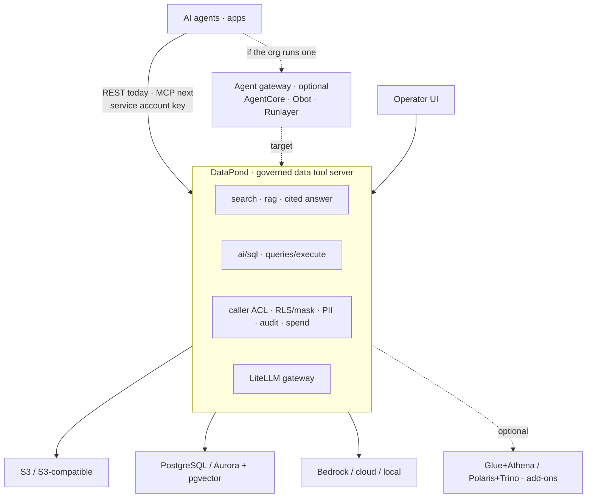

# DataPond 제품 컨셉 — AI 에이전트·앱을 위한 Governed 데이터 도구 서버

**버전:** 6.0 · **상태:** 현재 제품 기준 · **갱신:** 2026-09-07 (트렌드 조정 반영)

> **v6.0 승격 (2026-09-07):** `CONCEPT_RECONFIRMATION.md`의 v6 제안을 정본으로 올렸다. 결정과
> 근거는 `POSITIONING_REVIEW.md`(§5에 2026-09 시장 트렌드 대조), 새 문장 기준의 기능·사용성
> 적합도는 `POSITIONING_FIT_AUDIT.md`에 있다. v5.0("Portable AI Data Foundation")은 이 문서로 대체된다.

## 한 문장

> **DataPond는 AI 에이전트와 애플리케이션이 회사의 문서와 테이블에 접근하는 governed 데이터
> 도구 서버다. 인용 RAG와 governed SQL을 도구로 노출하고, 어떤 호출자가 어떤 컬렉션·행을
> 읽을 수 있는지, 무엇이 인용되고 무엇이 마스킹됐는지, 얼마까지 쓸 수 있는지를 데이터 계층에서
> 통제한다. AWS 위에서 바로 운영하고, 개방 계약 위에 있어 잠기지 않는다.**

기본 경로는 **에이전트나 앱이 DataPond를 직접 호출하는 것**이다. 오늘은 REST/OpenAPI + 서비스 계정
키, 다음 슬라이스는 MCP 서버(아직 shipped 아님). 조직에 에이전트 게이트웨이가 있으면 그 뒤에 타깃으로
등록할 수도 있다. AWS는 가장 구체적인 레퍼런스 배포이지만 제품의 경계는 아니다.

## 게이트웨이가 있어도 없어도

기본 경로는 직접 호출이다. 에이전트마다 서비스 계정 키를 발급하면 호출자 단위 접근·감사·spend가
그대로 붙는다. 첫 세그먼트의 파일럿은 대부분 이 단계에 있다.

2026년 하반기 시장에서 "에이전트 도구 게이트웨이"(identity, 정책, 레지스트리, tool 호출 단위
감사)는 플랫폼에 흡수되고 있다. AWS AgentCore Gateway, Databricks Unity AI Gateway, Snowflake
Cortex AI Gateway, 그리고 Obot·Runlayer 같은 전문 게이트웨이가 그 층이다. DataPond는 그 층을
만들지 않으며, 그 층을 전제하지도 않는다. 두 제품은 직교한다. 게이트웨이는 도구와 에이전트 사이의
중앙 정책을, DataPond는 도구가 돌려주는 **데이터의 범위**를 다룬다. 조직에 게이트웨이가 있으면
DataPond를 타깃으로 등록하면 되고(등록 절차는 how-to 문서), 없으면 직접 부르면 된다.

| 게이트웨이가 하는 것 | DataPond가 하는 것 |
|---|---|
| 인바운드 OAuth/JWT, 에이전트 identity | 서비스 계정 키(직접 호출), 또는 게이트웨이가 넘긴 principal(token exchange, roadmap) |
| tool 단위 허용/거부 정책, rate limit | 그 tool이 **데이터의 어느 부분**을 돌려줄지: 컬렉션 멤버십, 행 필터, 컬럼 마스킹 |
| 호출 단위 감사(principal, 정책, 지연) | 검색·답변 단위 감사: 어느 컬렉션, 무엇이 인용됐는지, 무엇이 마스킹됐는지 |
| tool·그룹 단위 예산 알림 | 호출자 단위 spend 귀속과 예산 |
| Guardrails로 프롬프트·응답 PII | 적재·검색·인용 시점의 데이터 PII, 한국형 식별자 |

AWS는 AgentCore Gateway가 row-level 데이터 접근, RAG 인용·검색 거버넌스, 에이전트별 예산 상한을
다루지 않는다고 스스로 명시한다. Databricks·Snowflake는 그것을 하지만 자기 플랫폼 안에서만 한다.
DataPond의 자리는 그 사이다.

게이트웨이 뒤 등록의 한계는 알고 있어야 한다. AgentCore Gateway는 OpenAPI·MCP 타깃에 token
passthrough를 지원하지 않으므로 API key로 등록하면 게이트웨이 뒤의 모든 에이전트가 서비스 계정
하나로 보인다. 호출자 단위를 유지하려면 에이전트당 서비스 계정·타깃을 두거나(지금 가능), 외부 OIDC
access token을 API bearer로 받는 resource-server 모드와 token exchange가 필요하다(roadmap). 이
모드는 게이트웨이 때문이 아니라 MCP 2026-07-28의 OAuth 정렬 때문에 어차피 필요하다.

## 해결하는 문제

에이전트나 앱이 사내 데이터를 건드리기 시작하면 팀은 다음을 직접 조립하게 된다.

- 어떤 호출자가 어떤 컬렉션·테이블을 읽어도 되는가
- 검색 결과와 답변에서 개인정보를 어떻게 가리는가
- 누가 무엇을 언제 물었고 무엇을 받았는가를 어떻게 남기는가
- 에이전트별로 모델 비용을 어떻게 귀속하고 막는가
- 소스 데이터가 바뀌면 검색 인덱스는 언제 따라가는가
- provider·모델·저장소가 바뀌어도 도구 계약은 그대로 유지되는가

DataPond는 이 **호출자 단위 거버넌스가 붙은 데이터 도구 면**을 제품으로 제공한다. 에이전트
프레임워크도, 분석 엔진 모음도 아니다. 에이전트는 사람보다 더 자주, 더 넓게, 더 예측 불가능하게
데이터를 만지므로 거버넌스가 가장 절실한 소비자다.

## 핵심 가치

### 1. 데이터 계층 거버넌스 (리드)

리드 메시지는 게이트웨이가 멈추는 지점 아래의 세 가지다.

1. **어떤 호출자가 어떤 컬렉션·행을 읽을 수 있는가** (컬렉션 안의 청크·문서 단위 필터는 roadmap)
2. **무엇이 인용됐고 무엇이 마스킹됐는가**
3. **호출자별로 얼마까지 쓸 수 있는가** (보조 메시지. 토큰 지출의 큰 몫은 코딩 에이전트에 있고,
   데이터 도구 호출의 spend는 그 일부다)

현재 구현된 것:

- 서비스 계정 키(`dp_sk_…`)와 역할 ∩ 스코프로 좁혀지는 권한, 키 만료
- 컬렉션 owner/admin/멤버(reader·editor) 애플리케이션 ACL
- 테이블 RLS 행 필터와 컬럼 마스킹(SQL rewrite, `governance.rls.enabled`)
- SQL 문장 종류 게이트: 쓰기 문장은 `query:write` 필요, 분류 실패 시 차단
- 한국형 구조화 PII 마스킹: 적재 시, 검색 결과·인용에서 재마스킹
- 권한 결정 감사(모든 거부 + 쓰기 허용), DB 트리거로 append-only, NDJSON export
- 호출자 ID를 LiteLLM `end_user`로 전달해 서비스 계정별 usage/spend 조회
- 성공한 search·rag·sql·query 호출의 append-only 도구 호출 감사(호출자, 컬렉션·테이블, hit 수, 인용 source, 마스킹 수), NDJSON export

아직 아닌 것(로드맵 표기 원칙):

- 호출자별 예산 **강제**(현재는 LiteLLM 가상 키 예산과 조회만)
- 키에 컬렉션·테이블 범위를 직접 묶는 것(현재는 멤버십·RLS로 간접)
- Production default-deny RLS, WORM 감사(앱 role이 테이블 owner)
- NER 기반 PII, 호출자·컬렉션별 PII 정책

### 2. 도구로서의 인용 RAG와 governed SQL

- 오늘: REST/OpenAPI. 다음 슬라이스: MCP 2026-07-28(stateless HTTP, OAuth/OIDC 정렬) read 전용
  서버를 기존 액션 레지스트리 위에 얹는다. 에이전트가 직접 붙는 경로이며, 조직에 게이트웨이가
  있으면 같은 서버를 타깃으로 등록한다.
- `/api/ai/search`, `/api/ai/rag`: pgvector HNSW 검색, 선택적 rerank, `[n]` 인용, 실패 시 hit만 반환
- `/api/ai/sql` + `/api/queries/execute`: 자연어 → SQL 생성, 테이블 해석·RLS·마스킹·LIMIT를 거친 실행
- `/api/api-surface`와 `/connect` 페이지: 실행 중인 라우트에서 생성된 엔드포인트 목록과 curl 예시
- 텍스트·S3·Iceberg 소스 적재, `source_group` 단위 교체, 인프로세스 freshness 스케줄러

### 3. 잠기지 않음 (반대 제거)

이식성은 헤드라인이 아니라 구매 반대를 없애는 조건이다. 계약은 다음과 같다.

| 경계 | 계약 |
|---|---|
| Object | S3 API |
| State/vector | PostgreSQL + pgvector |
| Table | Parquet + Apache Iceberg, 사용 시 |
| Model | LiteLLM 논리 model name, OpenAI-compatible API |
| Identity | JWT, LDAP, WebAuthn, OIDC |
| Deployment | OCI image, Helm, Kubernetes |
| Application | REST/OpenAPI |

통합 export/import CLI와 자동 exit drill은 roadmap이다. 그 전까지 "portable"은 설계 계약이지 검증된
절차가 아니다. 상세는 [PORTABILITY.md](PORTABILITY.md).

### 4. AWS-Ready, Not AWS-Locked

AWS single-node reference는 EC2/K3s, Aurora PostgreSQL Serverless v2 + pgvector, S3, Glue + Athena,
Bedrock via LiteLLM, ECR/IAM/Route53/Secrets Manager/CloudWatch를 실제 제공한다. EKS, EMR Serverless,
S3 Tables, Lake Formation, AOSS, DataZone, Marketplace는 만들지 않으며 roadmap이다.

## 제품 구조

```mermaid
flowchart TB
    AGENT[AI agents · apps] -- REST today · MCP next<br/>service account key --> TOOLS
    AGENT -. if the org runs one .-> GW[Agent gateway · optional<br/>AgentCore · Obot · Runlayer]
    GW -. target .-> TOOLS

    subgraph TOOLS[DataPond · governed data tool server]
      RAG[search · rag · cited answer]
      SQL[ai/sql · queries/execute]
      GOV[caller ACL · RLS/mask · PII · audit · spend]
      GATE[LiteLLM gateway]
    end

    OPS[Operator UI] --> TOOLS
    TOOLS --> STORE[S3 / S3-compatible]
    TOOLS --> VECTOR[PostgreSQL / Aurora + pgvector]
    TOOLS --> MODEL[Bedrock / cloud / local]
    TOOLS -. optional .-> PLANE[Glue+Athena / Polaris+Trino · add-ons]
```

## 사용자와 주요 여정

### Primary: 에이전트·AI 앱을 만드는 팀

- 에이전트나 앱이 사내 문서·테이블에 접근해야 하는데 권한·PII·감사·비용을 직접 만들 여력이 없다.
- 고객 계정/VPC 안에서 작은 팀이 운영한다.
- 첫 여정: **컬렉션 생성 → 적재 → 서비스 계정 키 발급 → 앱에서 `/ai/rag` 호출 → Governance·AI
  Gateway에서 호출자별 접근·PII·spend 확인**.

### Secondary: 운영자·플랫폼 팀

- 어떤 에이전트가 무엇에 접근하는지 한 화면에서 보고 끊고 싶다.
- S3/Iceberg 테이블을 도구 면에 연결한다(Glue/Athena 또는 Polaris/Trino).

### 첫 세그먼트

AWS 위에서 사내 문서·테이블에 에이전트 접근을 열고 싶지만 **개인정보보호법 대응**이 걸리는 한국
기업. 2026년 개인정보위 계획은 매출 10% 과징금, 2026년 6월부터 CEO 최종 책임, ISMS-P 강화다.
AWS Summit Seoul 2026의 규제 환경 에이전트 세션은 책임 소재와 감사 투명성을 pain으로 짚었고
파트너 제품은 언급되지 않았다. 이 세그먼트에 필요한 구체물은 다음 셋이다.

- 주민번호·휴대전화·사업자번호 등 한국형 식별자의 적재·검색·인용 마스킹 증적
- CEO 책임에 대응하는 호출자별 검색·답변 감사와 export
- ISMS-P 심사에 낼 수 있는 NDJSON 증빙

한국형 PII 마스킹과 AWS reference는 이미 있다. UI는 영어이고 한국어인 것은 운영 문서다(한국어 UI의
필요 여부는 파트너 대화에서 확인). 의료·법률·금융 같은 규제 버티컬은 WORM
감사와 default-deny가 갖춰진 뒤의 두 번째 단계다.

## 메뉴 정보구조

| 영역 | 메뉴 | 원칙 |
|---|---|---|
| Home | Dashboard | profile, core workflow, health |
| Build AI | Knowledge, API | 모든 프로필에서 표시. API는 도구 면의 진입점 |
| Data | Sources, Catalog, Analytics | adapter capability가 true일 때만 |
| Add-ons | Transforms, Streaming, Notebooks, Experiments | 해당 add-on 활성화 시에만, 지원 티어 배지 |
| Operate | AI Gateway, Governance, Storage, Infrastructure, Settings | 호출자·비용·정책 운영 |
| Learn | Help | shipped/optional/roadmap 구분 |

## 배포 프로필

앞세우는 두 개:

- **Portable Core · AWS starter** (`values-foundation.yaml`): S3/Bedrock + in-cluster pgvector.
- **AWS Single-Node Reference** (`values-prod-single.yaml`): Terraform 기반 Aurora/S3/Glue/Athena/Bedrock.

나머지(`values-aws.yaml`, `values-onprem.yaml`, dev/quicktest/prod)는 compatibility·개발용이다.
상세는 [DEPLOYMENT_PROFILES.md](DEPLOYMENT_PROFILES.md).

## 거버넌스 경계

- 컬렉션 보안은 PostgreSQL native RLS가 아니라 application-level owner/admin/member ACL이다.
- 테이블 RLS/마스킹은 SQL rewrite이며 `/queries/execute` 경로에 적용된다. `/ai/sql`은 생성만 한다.
- 감사는 권한 결정과 도구 호출 두 축이다. 둘 다 append-only이며 WORM은 아니다.
- 예산은 조회·알림이며 강제가 아니다.
- UI capability gate는 UX 경계이며 API authorization을 대체하지 않는다.
- 게이트웨이 뒤 등록 시 호출자 단위가 약해지는 한계는 "게이트웨이가 있어도 없어도" 절에 있다.
  컬렉션 안의 청크·문서 단위 호출자 필터는 roadmap이다.

## 출구 전략

S3 API로 접근 가능한 object, PostgreSQL dump/restore 가능한 state와 pgvector, Helm values의 adapter
설정, LiteLLM logical model mapping, 활성화 시 Parquet/Iceberg metadata가 이동 가능한 자산이다.
embedding model/dimension 변경 시 re-embedding, `ENCRYPTION_KEY` 없이는 credential 복호화 불가.

## Open Core 원칙

Community에 남는 것: 데이터·metadata export와 provider 변경 경로, 도구 면과 adapter interface,
S3/PostgreSQL/LiteLLM/Iceberg 표준 지원, 기본 access/PII/audit/spend 거버넌스.

Enterprise 후보: OIDC SSO(현재), 호출자별 예산 강제와 정책 팩, 감사 SIEM/WORM export, 다중 환경
운영, SLA/support. 고객의 데이터를 이동시키는 기능은 상용 edition으로 잠그지 않는다.

## 경쟁 기준

| 대안 | 관계 | DataPond의 자리 |
|---|---|---|
| AWS AgentCore Gateway + Guardrails | **직교.** 있으면 타깃으로 등록, 없어도 무방 | 게이트웨이가 명시적으로 안 하는 row-level 접근, 인용·검색 감사, 호출자별 예산 |
| Bedrock Managed Knowledge Base | 대체 가능한 retrieval | 컬렉션·행 단위 호출자 ACL, 인용 감사, provider·vector 교체, 온프렘 옵션 |
| Databricks Unity AI Gateway / Snowflake Cortex AI Gateway | 같은 문제를 자기 플랫폼 안에서 해결 | 플랫폼 밖, 고객 계정·VPC 안, 개방 계약 |
| Obot·Runlayer·Natoma 등 MCP 게이트웨이 | **직교.** identity·레지스트리·정책 층 | 데이터 계층 거버넌스. 있으면 그 뒤, 없으면 직접 |
| 에이전트 프레임워크 + DIY 도구 | 자유도 | 반복되는 거버넌스 배관을 제품화, 운영 UI |

DataPond는 게이트웨이, warehouse, 에이전트 프레임워크와 경쟁하지 않는다. **게이트웨이가 멈추는
지점 아래, 에이전트가 데이터에 닿는 곳의 거버넌스**에서 경쟁한다. 이 자리는 12~18개월 안에
AWS나 데이터 플랫폼이 채울 수 있으므로, 그 전에 파트너 1곳과 감사·MCP 두 조각을 갖추는 것이
창을 쓰는 방법이다.

## 하지 않을 것

- **게이트웨이 기능:** 에이전트 레지스트리, SSO/SCIM 동기화, rug-pull 탐지, tool 단위 정책 엔진
- 코딩 에이전트 토큰 spend 통제, spend를 리드 메시지로 쓰는 것
- 온톨로지 Phase 1·GraphRAG (수요 게이트 유지)
- add-on 추가, Databricks/Snowflake 비교표
- 운영자용 어시스턴트 액션 추가
- 규제 버티컬을 첫 파트너로 삼는 것

## 상태 표기

- **Shipped:** 코드, Helm wiring, 테스트가 존재하고 유지되는 기능.
- **Reference:** 실제 구성이 있으나 topology 제한이 있는 배포.
- **Optional:** 특정 profile/add-on에서만 제공. 지원 티어 배지를 따른다.
- **Roadmap:** 문서나 설계 이력은 있으나 현재 배포가 제공하지 않는 기능.

현재 canonical 문서는 [루트 README](../README.md)와 [active docs index](README.md) 목록이다.
`superpowers/plans`와 `superpowers/specs`는 역사 기록이다.
